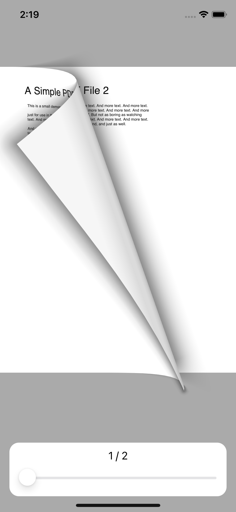
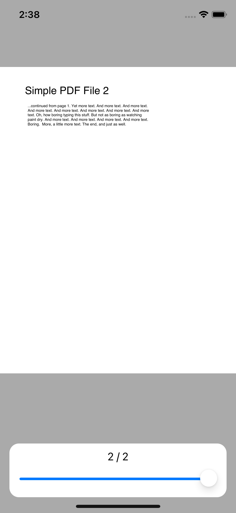

# SOPDFReader

[](https://swift.org)
[](https://developer.apple.com/xcode)
[](https://github.com/sozman/instagram-clone-swiftUI.git)
[](https://opensource.org/licenses/MIT)


## Overview
A simple pdf reader

## Features:
* Local PDF file
* Get PDF from the internet

## Requirements
* iOS 13+
* Xcode 11.0+
* Swift 5.0+

## Installation

### Swift Package Manager

The [Swift Package Manager](https://swift.org/package-manager/) is a tool for automating the distribution of Swift code and is integrated into the `swift` compiler. It is in early development, but Alamofire does support its use on supported platforms.

Once you have your Swift package set up, adding SOPDFReader as a dependency is as easy as adding it to the `dependencies` value of your `Package.swift`.

```swift
dependencies: [
    .package(url: "https://github.com/sozman/SOPDFReader.git", .upToNextMajor(from: "1.0.0"))
]
```

### Manually

If you prefer not to use any of the aforementioned dependency managers, you can integrate SOPDFReader into your project manually.

#### Embedded Framework

- Open up Terminal, `cd` into your top-level project directory, and run the following command "if" your project is not initialized as a git repository:

  ```bash
  $ git init
  ```

- Add SOPDFReader as a git [submodule](https://git-scm.com/docs/git-submodule) by running the following command:

  ```bash
  $ git submodule add https://github.com/sozman/SOPDFReader.git
  ```

- Open the new `SOPDFReader` folder, and drag the `SOPDFReader.xcodeproj` into the Project Navigator of your application's Xcode project.

    > It should appear nested underneath your application's blue project icon. Whether it is above or below all the other Xcode groups does not matter.

- Select the `SOPDFReader.xcodeproj` in the Project Navigator and verify the deployment target matches that of your application target.
- Next, select your application project in the Project Navigator (blue project icon) to navigate to the target configuration window and select the application target under the "Targets" heading in the sidebar.
- In the tab bar at the top of that window, open the "General" panel.
- Click on the `+` button under the "Embedded Binaries" section.
- You will see two different `SOPDFReader.xcodeproj` folders each with two different versions of the `SOPDFReader.framework` nested inside a `Products` folder.

    > It does not matter which `Products` folder you choose from, but it does matter whether you choose the top or bottom `SOPDFReader.framework`.

- Select the top `SOPDFReader.framework` for iOS and the bottom one for macOS.

- And that's it!

  > The `SOPDFReader.framework` is automagically added as a target dependency, linked framework and embedded framework in a copy files build phase which is all you need to build on the simulator and a device.

## Usage

### Quick Start

```swift
import UIKit
import SOPDFReader
import SnapKit

class ViewController: UIViewController {
    let examplePDFURL = "http://www.africau.edu/images/default/sample.pdf"
    var sopdfReaderController: UIViewController?
    override func viewDidLoad() {
        super.viewDidLoad()
        // Do any additional setup after loading the view.
        self.sopdfReaderController = SOPDFReader.createModule(pdfLink: examplePDFURL)
        addChild(sopdfReaderController!)
        view.addSubview((sopdfReaderController?.view)!)
        
        sopdfReaderController?.view.snp.makeConstraints({ (make) in
            make.edges.equalTo(0)
        })
        
        sopdfReaderController?.didMove(toParent: self)
    }
}
```

## Screenshots
### Example
|  |  | 
|:---:|:---:|

## Author
Sinan Özman, sinanozman@icloud.com

## License
Instagram-clone-swiftUI is available under the MIT License, see LICENSE for more information.